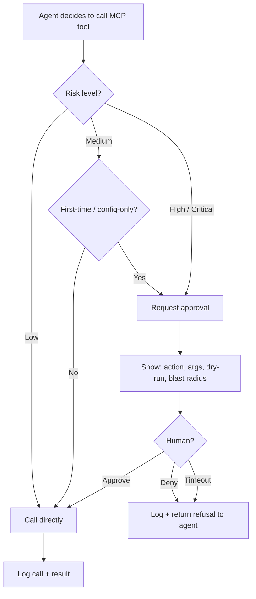

# MCP approval flows

How to gate risky MCP calls behind explicit human approval — without making the agent painful to use.

## Principles

1. **Approve actions, not tools.** Granting "the agent can use `gh`" is too broad. Gate per call: "send THIS PR, with THIS body."
2. **Show the diff.** A good approval prompt shows exactly what will happen, not abstractly what could.
3. **Default-deny for High/Critical.** No silent fall-through.
4. **Never auto-approve on timeout.** That's the opposite of safety.
5. **Audit every decision.** Approvals AND denials.

## Flow



## Approval message format

```yaml
approval_request:
  server: github
  tool: pull_request.create
  args:
    repo: org/app
    head: feat/cursor-pagination
    base: main
    title: "[api] Cursor pagination for /v1/orders"
    body: |
      …
  rationale: "Implements task in MEMORY.md#open"
  reversibility: reversible (can close PR)
  blast_radius: team
  dry_run:
    estimated_changed_files: 4
    estimated_diff_lines: ~120
```

## Patterns by risk

| Risk | Pattern |
|---|---|
| Low | No prompt; sample-log |
| Medium | One-time approval per (tool, repo/scope), remembered for the session |
| High | Per-call approval; dry-run preview required |
| Critical | Per-call approval **+ second reviewer**; out-of-band channel (chat / PR) |

## "Sticky" approvals

For repetitive medium-risk actions in one session, allow the user to approve a *batch* with explicit count: "Approve next 5 ticket creations." Track and stop at the limit. Never make sticky approvals open-ended.

## Revocation

A user can revoke approvals mid-run. The agent must:

1. Stop the in-flight call (if possible)
2. Roll back what's already done (when feasible)
3. Surface partial state and stop the loop

## Implementation hints

- Keep the approval mechanism *outside* the agent loop (file-based queue, IPC, web UI). Don't mix policy with model output.
- Sign approvals so they can't be forged by the agent itself
- Persist the audit log to durable storage, not just memory
