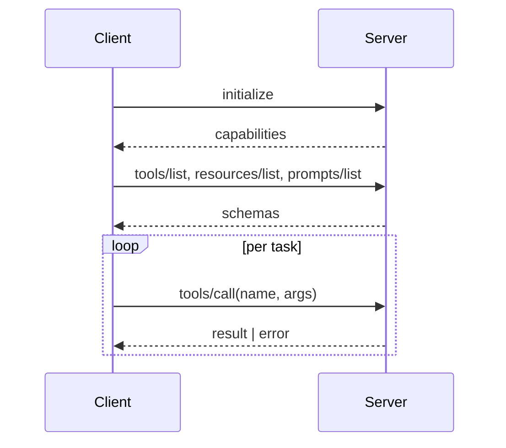

# MCP basics

## The 30-second version

MCP defines three things a server can expose to a client:

- **Tools** — actions the agent can invoke (`get_repo`, `create_issue`, …)
- **Resources** — read-only context the client can pull in (`file://...`, `gh:repo/...`)
- **Prompts** — pre-baked prompt templates the client can offer to users

All three are discoverable: the client calls a "list" method and the server replies with schemas.

## Why this matters

Function-calling is fragmented across providers. MCP is the **interop layer**: build a server once, and every compliant client can speak to it. The same `github` MCP server backs Claude Code, Cursor, Codex, and any custom agent built on the OpenAI Agents SDK or LangGraph.

## Lifecycle

## Transports

- **stdio** — server runs as a subprocess of the client. Local, low-latency.
- **SSE / HTTP streaming** — server is a separate (possibly remote) process.

Pick by deployment, not by capability — both transports support the same protocol.

## What a server actually contains

- Tool definitions with JSON Schemas
- Implementations (any language)
- Optionally: resource URIs and prompt templates
- A `package.json` / `pyproject.toml` to install + run

## Building one: 3 steps

1. **Define tools** — name, description, input schema, output schema
2. **Implement handlers** — pure functions over inputs
3. **Wrap with the MCP SDK** — Python (`mcp`), TypeScript (`@modelcontextprotocol/sdk`)

Then point a client at it via stdio or HTTP. That's it.
